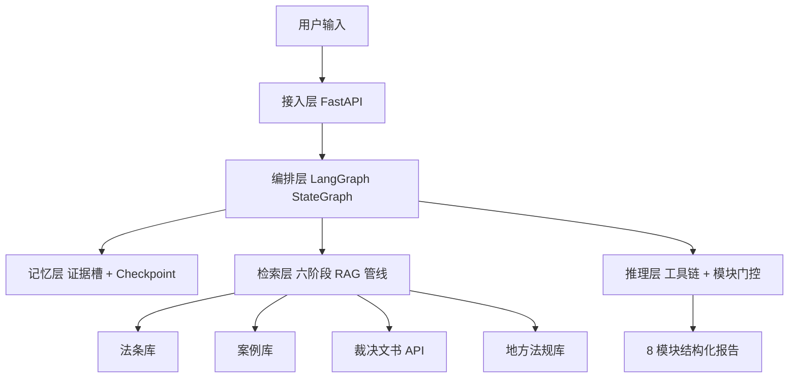

# Case_Review_Analysis_agent
一个能够为你提供法律案情解读分析、援助的智能体
# 劳动纠纷智能审查 Agent

面向 C 端劳动者的智能法律分析助手。用户用自然语言描述遭遇（如"公司辞退我没给赔偿，月薪 8000，干了 2 年半"），Agent 自动完成法律定性、赔偿金计算、相似案例匹配、证据清单生成，最终输出 8 模块结构化分析报告。核心目标是将劳动法律师首次咨询的标准化工作 AI 化，让普通劳动者在维权前搞清楚四件事：**法律上怎么定性、经济上怎么量化、手里有什么筹码、下一步怎么走**。

## 演示

### 完整对话流程

用户输入案情描述，Agent 自动追问缺失信息、检索法律依据、生成结构化报告：


### 8 模块分析报告

| 模块 | 内容 |
|------|------|
| 案情摘要 | 3-5 句话复述案情，确保理解正确 |
| 赔偿金额估算 | 分项计算 + 公式展示 + 最低~最高区间 |
| 法律依据 | 法条引用（精确到条、款）+ 大白话解读 |
| 相似案例参考 | 3-5 个类似判例 + 相似度 + 差异标注 |
| 证据清单 | 已有证据 vs 待收集证据 + 紧急程度 |
| 行动路径建议 | 协商 → 投诉 → 仲裁 → 诉讼 四步时间线 |
| 风险提示 | 不利因素 + 不确定因素 + 免责声明 |
| 法律定性结论 | 一句话收束全文 |


### 证据槽可视化

系统自动提取用户画像与关键事实，槽位三态（MISSING/DERIVED/PROVIDED）直观展示，缺失项按优先级驱动主动追问：


### 防幻觉溯源

每个法条引用精确到条、款，附原文片段，不可溯源内容主动标注"待核实"：


## 项目架构



## 核心亮点

- **Agent 闭环**：LangGraph 图结构 + LLM 自主决策，`extract_evidence → decide → ask_user/search/generate` 循环，非硬编码状态机，支持条件分支与循环边
- **证据槽驱动**：20+ 结构化槽位（三态 + 置信度 + P0~P3 优先级），缺什么问什么，不多问不重复问
- **六阶段 RAG**：三层意图路由 → 查询改写 → 并行多路召回 → RRF 融合 → Cross-Encoder 精排 → 三重自检
- **四库异构检索**：法条库 / 案例库 / 裁决文书（北大法宝 API）/ 地方法规库，差异化检索策略
- **动态模块门控**：根据意图与检索结果自动调整 8 模块输出内容，检索不到案例则不展示"相似案例参考"，无模块空占位
- **双层防幻觉**：检索侧三重自检（置信度 / 覆盖度 / 冲突检测）+ 生成侧强制溯源标注 + 实体比对
- **SSE 流式输出**：逐字实时推送，秒级首字响应
- **多模型降级**：DeepSeek → 豆包 → 千问，独立断路器，用户无感知切换

## 技术栈

| 层级 | 技术 | 用途 |
|------|------|------|
| 编排 | LangGraph、Pydantic | 图结构状态管理、数据结构校验 |
| 接入 | FastAPI、SSE | RESTful API + 流式输出 |
| 检索 | Milvus、BM25、bge-reranker-base | 向量检索 + 关键词检索 + 精排 |
| 存储 | PostgreSQL、Redis | 结构化数据、缓存 / Session |
| 日志 | loguru | trace_id 全链路追踪 |
| 前端 | Streamlit | 内部演示界面 |

## 快速开始

### 环境要求

- Python 3.10+
- Milvus 2.3+
- PostgreSQL 14+
- Redis 7+

### 安装

```bash
git clone https://github.com/xulianwen-hub/Case_Review_Analysis_agent.git
cd Case_Review_Analysis_agent
pip install -r requirements.txt
```

### 配置

```bash
cp .env.example .env
# 编辑 .env 填入 LLM API Key、数据库连接等
```

### 初始化知识库

```bash
# 导入劳动法条库
python scripts/init_law_db.py

# 导入诉讼案例库
python scripts/init_case_db.py

# 构建向量索引
python scripts/build_index.py
```

### 启动服务

```bash
# 启动后端 API
uvicorn src.agent.api:app --host 0.0.0.0 --port 8000

# 启动演示界面（可选）
streamlit run demo/app.py
```

## 项目结构

```
Case_Review_Analysis_agent/
├── src/
│   ├── agent/                 # Agent 核心
│   │   ├── api.py             # FastAPI 服务（单轮对话 + SSE 流式）
│   │   └── orchestrator.py    # 对话编排器
│   ├── core/                  # 核心模块
│   │   ├── config.py          # 全局配置（LLM / 数据库 / 检索参数）
│   │   ├── llm_client.py      # 多模型客户端（含断路器与降级）
│   │   └── logger.py          # 结构化日志（trace_id 全链路追踪）
│   ├── data/                  # 数据管道
│   │   ├── ingest.py          # 文档智能解析（DOCX / PDF）
│   │   └── pipeline.py        # 语义分块 + 向量化 + 入库
│   ├── memory/                # 记忆层
│   │   ├── evidence_slots.py  # 证据槽管理（三态 / 置信度 / 优先级）
│   │   ├── short_term.py      # 短期记忆（滑动窗口上下文）
│   │   └── summary_buffer.py  # 摘要压缩（长对话降本）
│   ├── prompts/               # Prompt 模板
│   │   └── templates.py       # 8 模块报告模板 + 追问模板 + 工具调用模板
│   ├── rag/                   # 检索增强生成（六阶段 RAG）
│   │   ├── router.py          # 三层意图路由（规则 → 分类器 → LLM）
│   │   ├── rewriter.py        # 查询改写（Simple/Medium/Complex + HyDE）
│   │   ├── retriever.py       # 并行多路召回（四库差异化策略）
│   │   ├── fusion.py          # RRF 融合与意图加权粗排
│   │   ├── ranker.py          # Cross-Encoder 精排（bge-reranker-base）
│   │   └── checker.py         # 三重自检（置信度 / 覆盖度 / 冲突）
│   └── state/                 # 状态管理与多轮对话
│       ├── api.py             # 多轮对话 API（/api/agent/chat）
│       ├── graph.py           # LangGraph StateGraph 图定义
│       ├── orchestrator.py    # 状态编排器
│       ├── extractor.py       # LLM 结构化案情提取
│       ├── report.py          # 8 模块动态组装 + 模块门控
│       ├── session.py         # 会话生命周期管理
│       └── tools/             # 劳动纠纷专用工具链
│           ├── registry.py    # 工具注册与调度
│           ├── compensation.py    # 赔偿金计算（N/N+1/2N 规则引擎）
│           ├── statute_limitation.py # 仲裁时效计算
│           └── evidence_gen.py     # 证据清单生成
├── demo/                      # 演示界面
├── scripts/                   # 初始化与运维脚本
├── tests/                     # 测试
├── docs/                      # 文档与演示素材
├── requirements.txt
└── .env.example
```

## API 文档

启动服务后访问 `http://localhost:8000/docs` 查看 Swagger 文档。

### 核心接口

| 端点 | 方法 | 说明 |
|------|------|------|
| `/api/chat` | POST | 单轮对话，一次性返回完整结果 |
| `/api/chat/stream` | POST | SSE 流式输出，逐字推送 |
| `/api/agent/chat` | POST | 多轮对话，返回 Agent 决策状态 + 证据槽 + 建议动作 |
| `/api/agent/reset` | POST | 重置指定会话 |
| `/api/agent/sessions` | GET | 查看当前活跃会话数 |
| `/api/health` | GET | 健康检查 |
| `/api/ingest` | POST | 增量录入法条文档 |
| `/api/pipeline/status` | GET | 查看数据管道状态 |

### 请求示例

```bash
# 单轮对话
curl -X POST http://localhost:8000/api/chat \
  -H "Content-Type: application/json" \
  -d '{"message": "公司辞退我没给赔偿，月薪8000，干了2年半"}'

# SSE 流式输出
curl -X POST http://localhost:8000/api/chat/stream \
  -H "Content-Type: application/json" \
  -d '{"message": "公司辞退我没给赔偿，月薪8000，干了2年半"}'

# 多轮对话
curl -X POST http://localhost:8000/api/agent/chat \
  -H "Content-Type: application/json" \
  -d '{"session_id": "test-001", "message": "公司辞退我没给赔偿"}'
```

## 评估指标

| 指标 | 说明 | 目标 |
|------|------|------|
| 幻觉率 | 生成内容中不可溯源比例 | < 5% |
| 证据槽完成率 | P0 级关键信息自动提取覆盖率 | > 90% |
| 赔偿计算准确率 | 与律师计算结果对比 | > 95% |
| 平均端到端延迟 | 用户输入到首字输出 | < 3s |
| 检索召回率 | 相关文档是否被检索到 | > 85% |

## 后续规划

- [ ] 多模态支持（图片上传 → OCR 提取 → 自动填入证据槽）
- [ ] 微信小程序端接入
- [ ] 用户历史案件管理与进度追踪
- [ ] 支持更多劳动争议类型（工伤认定、社保纠纷、竞业限制）

## License

MIT
